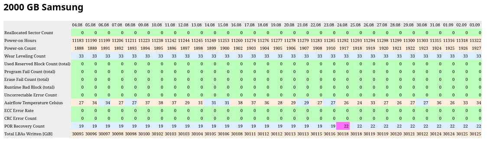

Description
===========

If `smartmontools` are configured correctly, i.e. through files
`/etc/default/smartmontools` and `/etc/smartd.conf` they automatically notify
on critical events via system-local e-mail and also keep track of the state
of the drives under `/var/lib/smartmontools`.

Apart from that, not much help in attaching the data to monitoring systems is
offered. Also, thinking of the SMART data as a “pre-failure” warning mechanism,
it may make sense to check the state of the drives on a regular basis. If such a
check is not supported by a tool, it can be forgotten rather easily.

This package contains scripts that are intended to supplement smartmontools'
capabilities by formatting the last days' SMART values in a text-based table.
The table shows the values of the attributes over multiple days, allowing the
user to identify any noteworthy or unexpected changes.

Additionally, a script `log_nvme_state.pl` is supplied together with a Systemd
Timer file to collect similar data from NVMe drives.

To build this package use `ant package`.

These scripts are not designed for standalone operation. Rather, the intended
usage is to integrate them in a place where one regularly views the data such as
e.g. logwatch, monit or similar tools.

`smart_csv_to_table.pl` - Tracking the State of HDDs and SSDs
=============================================================

For typical SATA drives, `smartd` automatically stores information about all of
the SMART attributes in CSV files under `/var/lib/smartmontools`.

E.g. for a typical SSD this might look as follows:

~~~
$ head -n 5 /var/lib/smartmontools/attrlog.Samsung_SSD_850_EVO_2TB-*.ata.csv
2025-05-13 19:23:07;	5;100;0;	9;97;10736;	12;98;1825;	[...]
2025-05-13 19:53:07;	5;100;0;	9;97;10736;	12;98;1825;	[...]
2025-05-13 20:23:07;	5;100;0;	9;97;10737;	12;98;1825;	[...]
2025-05-13 20:53:07;	5;100;0;	9;97;10737;	12;98;1825;	[...]
2025-05-13 21:23:07;	5;100;0;	9;97;10738;	12;98;1825;	[...]
$ tail -n 5 /var/lib/smartmontools/attrlog.Samsung_SSD_850_EVO_2TB-*.ata.csv
2025-08-31 17:13:35;	5;100;0;	9;97;11309;	12;98;1924;	[...]
2025-08-31 17:43:35;	5;100;0;	9;97;11309;	12;98;1924;	[...]
2025-08-31 18:13:35;	5;100;0;	9;97;11310;	12;98;1924;	[...]
2025-08-31 18:43:35;	5;100;0;	9;97;11310;	12;98;1924;	[...]
2025-08-31 19:13:35;	5;100;0;	9;97;11311;	12;98;1924;	[...]
~~~

The format is as follows: Each line contains the point in time followed by the
values of all attributes at that time in the following format:

	Attribute ID;Normalized Value;Raw Value;

This could be analyzed by a spreadsheet, but the tools from this package offer
a script to analyze this data. It is called `smart_csv_to_table.pl` and
processes the most recent entries (for the current month) of such a given table
joining them with a human-readable information about the meaning of the
attribute IDs.

In order to generate such an information about the meaning of the attribute IDs,
`smartctl` can be used to place a file `monitoring.NAME.txt` next to the log
file `attrlog.NAME.csv` under `/var/lib/smartmontools`, e.g. by using the
following command line

	smartctl -A /dev/disk/by-id/ata-Samsung_SSD_850_EVO_2TB_S2RMNX0H900402N > /var/lib/smartmontools/monitoring.Samsung_SSD_850_EVO_2TB-S2RMNX0H900402N.ata.txt

The content of `monitoring.Samsung_SSD_850_EVO_2TB-S2RMNX0H900402N.ata.txt`
looks e.g.  like this:

~~~
smartctl 7.4 2023-08-01 r5530 [x86_64-linux-6.1.0-38-amd64] (local build)
Copyright (C) 2002-23, Bruce Allen, Christian Franke, www.smartmontools.org

=== START OF READ SMART DATA SECTION ===
SMART Attributes Data Structure revision number: 1
Vendor Specific SMART Attributes with Thresholds:
ID# ATTRIBUTE_NAME          FLAG     VALUE WORST THRESH [...] RAW_VALUE
  5 Reallocated_Sector_Ct   0x0033   100   100   010    [...] 0
  9 Power_On_Hours          0x0032   097   097   000    [...] 11311
 12 Power_Cycle_Count       0x0032   098   098   000    [...] 1924
177 Wear_Leveling_Count     0x0013   098   098   000    [...] 33
179 Used_Rsvd_Blk_Cnt_Tot   0x0013   100   100   010    [...] 0
181 Program_Fail_Cnt_Total  0x0032   100   100   010    [...] 0
182 Erase_Fail_Count_Total  0x0032   100   100   010    [...] 0
183 Runtime_Bad_Block       0x0013   100   100   010    [...] 0
187 Uncorrectable_Error_Cnt 0x0032   100   100   000    [...] 0
190 Airflow_Temperature_Cel 0x0032   065   055   000    [...] 35
195 ECC_Error_Rate          0x001a   200   200   000    [...] 0
199 CRC_Error_Count         0x003e   100   100   000    [...] 0
235 POR_Recovery_Count      0x0012   099   099   000    [...] 22
241 Total_LBAs_Written      0x0032   099   099   000    [...] 63173123890
~~~

As you can see, the ID 5 corresponds to Reallocated_Sector_Ct, 9 is
Power_On_Hours etc. The script combines this information into a neat table:

~~~
$ smart_csv_to_table.pl /var/lib/smartmontools/attrlog.Samsung_SSD_850_EVO_2TB-*.ata.csv
Attribute                   25      26      27      28      29      30      31
  9 Power On Hours          11293   11294   11298   11299   11300   11303   11311
 12 Power Cycle Count       1918    1919    1920    1921    1922    1923    1924
177 Wear Leveling Count     98:33   98:33   98:33   98:33   98:33   98:33   98:33
190 Airflow Temperature Cel 76:24   67:33   73:27   74:26   73:27   73:27   65:35
235 POR Recovery Count      99:22   99:22   99:22   99:22   99:22   99:22   99:22
241 Total LBAs Written      631~434 631~042 631~154 631~898 631~938 631~730 631~594
~~~

The first row consists of the number of the days (e.g. here 2025-08-25 ..
2025-08-31) and the first column contains a description for the ID and attribute
name with the underscores replaced by spaces for readability.

Not all attributes are reproduced: The ones where the normalized value is 200 or
100 for all columns are skipped because they commonly indicate “perfect
condition” variables which are only rarely of interest.

Finally, there are three styles by which the numbers are displayed compactly:

 * If space permits e.g. because the numbers are very short, a colon-separated
   information is printed in the form NORMALIZED:RAW to show both values.
 * If the number is too long for that type of display, only the raw value is
   shown.
 * If the number is too long to fit the column width, the first and the last
   three digits are shown and separated by a tilde (`~`).

`log_nvme_state.pl` - Tracking the States of NVMe Drives over Time
==================================================================

For a long time, `smartmontools` didn't support the logging of attributes of
NVMe drives, cf. <https://www.smartmontools.org/ticket/1190>.

If you have access to a reasonably recent smartmontools version, it may make
sense to prefer the logging implemented by smartmontools over the external
scripts presented in the following.

The script `log_nvme_state.pl` provides a way to query the state of all NVMe
drives in the system (using the `nvme` utility) and store the associated
attributes in a SQLITE database.

## SYSTEMD Support Files

In order to collect the required data, `log_nvme_state.pl` needs to be invoked
periodically. The systemd unit files (`masysma-log-nvme-state.service` and
`masysma-log-nvme-state.timer`) delivered as part of this package enable this,
causing the attributes to be collected once per hour if the timer is enabled.

`smart_sqlite_to_table.pl` - Formatting the NVMe Information as a Table
=======================================================================

To visualize the attributes stored by `log_nvme_state.ply` in a similar manner
to `smart_csv_to_table.pl`, the script `smart_sqlite_to_table.pl` may be used
e.g. as follows:

~~~
$ smart_sqlite_to_table.pl /var/lib/smartmontools/attrlog.INTEL_SSDPE2KX040T8-*.nvme.sqlite
INTEL SSDPE2KX040T8 at /dev/nvme1n1
Attribute                28     29     30     31     01     02     03
avail spare              100    100    100    100    100    100    100
controller busy time     246    246    246    247    247    247    247
data units read [TiB]    100.95 100.95 100.96 100.98 101.01 101.02 101.02
data units written [TiB] 25.71  25.71  25.74  25.85  25.86  25.87  25.89
host read commands       1.6e09 1.6e09 1.6e09 1.6e09 1.6e09 1.6e09 1.6e09
host write commands      1.0e09 1.0e09 1.0e09 1.0e09 1.0e09 1.0e09 1.0e09
power cycles             1986   1987   1988   1989   1990   1991   1992
power on hours           11034  11035  11038  11050  11051  11053  11056
spare thresh             10     10     10     10     10     10     10
temperature              317    316    317    318    317    317    317
unsafe shutdowns         28     28     28     28     28     28     28
~~~

Since there are no “normalized” values to deal with for NVMe drives, the data
is displayed as raw value by default. For large numbers, scientific notation is
used. For values with known units (e.g. `data_units_read`), a meaningful unit
(TiB) is used.

Previously Used: A PHP-based Evaluation Script
==============================================

Before attempting to integrate the SMART value report with other tools using a
common text-based format, a similar visualization of attribute values was
created using a PHP script (cf.
`old_php_smartd_auswertung/php_smartd_auswertung_quickm.php`).

For using this script, it was necessary to establish an XML-based configuration
(`php_smartd_auswertung_conf.xml`) that would contain the meanings of the
attribute IDs and also give a hint as to whether a change of the attribute value
was expected (e.g. Power on Hours) or not (e.g. Reallocated Sector Count). The
script would then paint the cells in the table in different colors, using a
visually striking magenta to picture unexpectedly changing values and using
pastel colors to show good or “change expected” values.

In the example, the “POR Recovery Count” attribute unexpectedly increased from
19 to 22 on 2025-08-24 hence the magenta marker.

The PHP script is old and not very convenient to use. Still, it is included here
because it still makes sense to keep the colorized tabular representation
in mind as a useful way to plot SMART values. It might be an inspiration for
future development on SMART attribute analysis and monitoring tools.

Future Directions
=================

Currently, Ma_Sys.ma systems do not ever run the SMART self-tests. This may be
something worth enabling (at least on HDDs) in the future.

See Also
========

 * <https://www.smartmontools.org/ticket/1190>
 * <https://unix.stackexchange.com/questions/653128/are-there-any-tools-available-to-store-smart-data-over-time>
